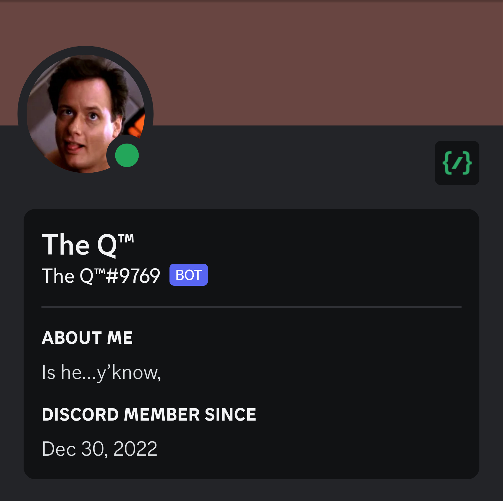

# The Q™
<p align="center">
  
</p>

The Q is a Discord bot, a wildly overengineered Rust monorepo, a
probably-not-necessary set of Protobuf tools, and most importantly the
culmination of years of “we should have a Discord bot that \_\_\_\_\_”
messages in the group chat.  It doesn’t do anything particularly useful but it
does do quite a few fun things, and by the gods it looks good doing ‘em.

## Installation

There are several ways to run The Q.  It can be used as a binary or built as a
container, and it also comes packaged with a complementary `docker-compose.yml`
to get log ingest and a dashboard with Grafana and Loki.

### As a Binary

To build just the binary for the bot, run:

```sh
$ cargo build --release --bin the-q
```

The executable will be located at `target/release/the-q` and ready for action.

### As a Container

To build a containerized version of the bot and tag it with `the-q:latest`,
run:

```sh
$ docker build --target bot -t the-q/latest .
```

_(You can replace `docker` with `podman` if you so desire.)_

Running the container is a little trickier than simply running the binary, but
still straightforward, as described below.

### With Docker Compose

Starting the services defined in `docker-compose.yml` will build the container
automatically, so no initial setup is required.  However, if you would like to
perform the build step separately, simply run the following:

```sh
$ docker-compose build
```

## Usage

Once installed the bot can simply be started by running the executable or
container and providing a Discord API token.  This can be done as
a command-line argument or as an environment variable (including within a .env
file).  To see all available command-line flags (and their corresponding
environment variables) run `the-q --help`.

### Loading the Environment

To load the Discord API token into the bot’s environment, create a file named
`.env.local` and add the following to it, replacing `MY_API_KEY` with your
actual API token:

```env
DISCORD_TOKEN=MY_API_KEY
```

If you don't yet have an API token, check out Discord's [getting started
tutorial](https://discord.com/developers/docs/getting-started) for info on how
to create a bot user and add it to your servers.

### Running the Binary

If you built The Q as a standalone binary, then starting the bot is as simple
as running `target/release/the-q`.

**NOTE:** `.env`, `.env.prod`, and `.env.local` must be within the current
working directory when you run the executable, otherwise the bot will silently
skip loading them.

### Running the Container

The containerized version of the bot will automatically run the binary inside
the container if the container is run with no arguments.  The `.env` and
`.env.prod` files from the repository are built into the container, and loading
`.env.local` can be done with the `--env-file` flag like so:

```sh
$ docker run --env-file .env.local the-q
```

If you wish to pass command-line arguments to the container, you must invoke
the binary directly:

```sh
$ docker run the-q bin/the-q --my-flags
```

### Running with Docker Compose

To provision the Grafana container, you will need to pass two environment
variables to `docker-compose`: `GF_USER` and `GF_PASSWD`.  These can be passed
to `docker-compose` any number of ways, but as an example the repository
provides a shell script `compose.sh` that loads them from a file.  To use the
script, create a file **directly inside the repository root** named
`.env.compose` and add the following to it:

```env
GF_USER=admin
GF_PASSWD=admin
```

Be sure to replace `admin` with a secure username and password.  Then, simply
invoke the script to run `docker-compose`:

```sh
$ ./compose.sh up -d
```
